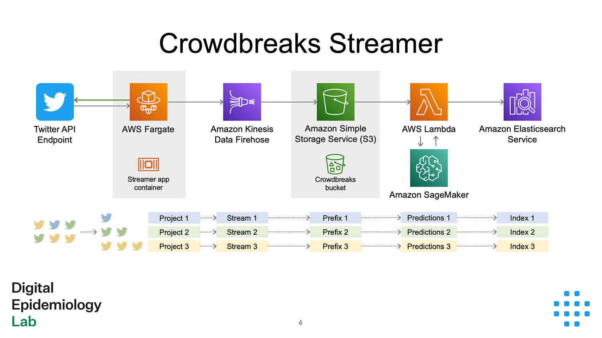

# Crowdbreaks Streamer
For data collection, Crowdbreaks leverages streaming endpoints within the Twitter Developer API. The infrastructure is set up using Amazon Web Services (AWS).

There is a Python [streamer](https://github.com/digitalepidemiologylab/crowdbreaks-streamer) app that runs on an AWS Fargate cluster and uses a [POST statuses/filter](https://developer.twitter.com/en/docs/twitter-api/v1/tweets/filter-realtime/api-reference/post-statuses-filter) (API v1.1) request to connect to a filtered stream of relevant tweets. The relevant tweets are filtered based on keywords and languages that are provided for each project within Crowdbreaks.

The whole data pipeline is set up using AWS. The streamer app itself runs on a Fargate cluster. After aquiring the tweets, it sends them over to their corresponding Kinesis Firehose Delivery Streams (one per project), which saves each project's tweets with a separate key-prefix ("folder") to a bucket in Simple Cloud Storage (S3). Each new batch of tweets being saved to S3 triggers an event that invokes a Lambda function, which preprocesses the tweets in the batch, makes predictions using a SageMaker endpoint and sends the preprocessed data over to a project's Elasticsearch index.

This way, Crowdbreaks is able to collect and keep Twitter data in a flexible and scalable fashion.
